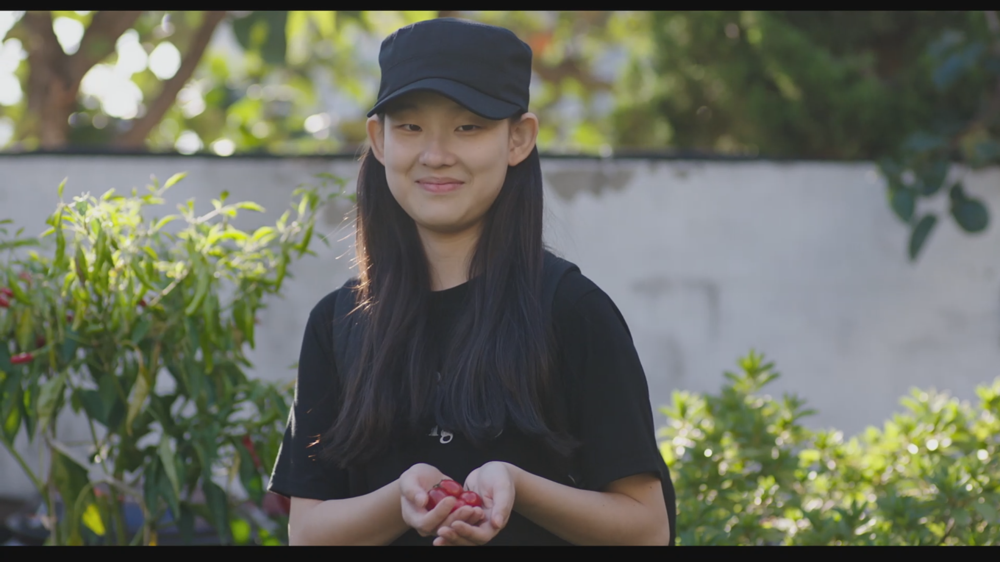

# 남매의 여름밤, 윤단비, 2019  
## 옥주가 비를 피할 수 있기를

자유가 고독함 임을 배우고 나서, 고독함을 극복해 보고자 글을 써 보기로 했다.
그동안 리뷰를 해보고 싶은 영화가 많긴 하지만, 첫 영화로 윤단비 감독의 첫 영화인 ‘남매의 여름밤’을 정했다.

영화 안에서 서로가 서로의 마음을 이해 못한다.
옥주는 엄마를 보고 싶어하는 동주의 마음을 이해하려 하지 않고,
아빠는 할아버지 입장에서 생각하지 못하고, 옥주의 마음에 상처를 준다.
그만큼 현대 사회에서 타인의 마음을 이해하고 보듬어 준다는 것이 힘든 일일까?

어떻게 하면,
타인의 마음을 이해할 수 있을까?
아니 타인의 마음에 상처를 주지 않을 수 있을까?

어떻게 하면,
우리가 유년시절 어린이(동주)처럼 감정에 솔직해지고 타인에게 상처를 주지 않을 수 있을까?

유일하게, 슬픈 음악을 들으면서 할머니를 그리워하는  할아버지를 몰래 지켜 보면서 할아버지의 마음을 이해하게 되고, 자신의 감정에 맞닥 들인다.

마지막에, 옥주가 밥을 먹다가 울음을 터트린 장면에서 아주 오래전 몽테뉴의 수상록에서 읽었던 내용이 생각났다[^1]. 정확히 기억은 안나지만
한 사람에게 슬픔이란 빈 병에 물이 채워지는 것 같아서, 어느 순간까지는 넘치지 않고 변화가 없다가 더 이상 담을 수 없을때  아주 작은 일에도 넘치게 되면 눈물처럼 흘러 내린다. 뭐 이런 느낌의 내용이었다.

할아버지에게 모자를 선물하고 서로 모자를 쓰고 웃는 장면이 너무 마음에 든다.
영화를 통해서 한번의 울음으로 해소는 되었겠지만,
포도는 햇살과 바람을 좋아하고 비를 싫어한다.

비가림을 통해 포도가 달고 맛있게 자랄 수 있도록
엄마를 그리워하는 옥주에게, 그러나 슬픔이 밖으로 나오지 못하게 차가운 이성으로 얼리고자 하는 옥주에게
겨울이 오기전에 비가 내리기 전에 모자를 씌어줄 수 있는 사람을 만났으면 좋겠다.

사랑을 많이 해봐야, 사랑을 배우고
유일하게, 사랑을 배워야 타인의 마음을 이해할 수 있다고 생각한다.

[^1]: “기원전 522년, 페르시아 왕 캄비세스가 이집트를 정복했을 때였다. 그는 이집트 왕 프삼메니투스를 치욕스럽게 만들 작정으로 가족과 친지가 지나가는 모습을 지켜보게 했다. 그런데 이집트 왕은 딸이 노예가 되어 물을 길러 가고 아들이 사형장으로 끌려가는 것을 보고도 슬퍼하지 않더니, 자신의 신하가 거지가 되어 병사들에게 동냥을 하는 모습을 보고는 대성통곡하기 시작했다. 그의 말대로 ‘거지로 전락한 신하의 불행은 울음으로 대신할 수 있지만 자식들의 불행은 울음으로 대신할 수 없었기 때문’이다.”
